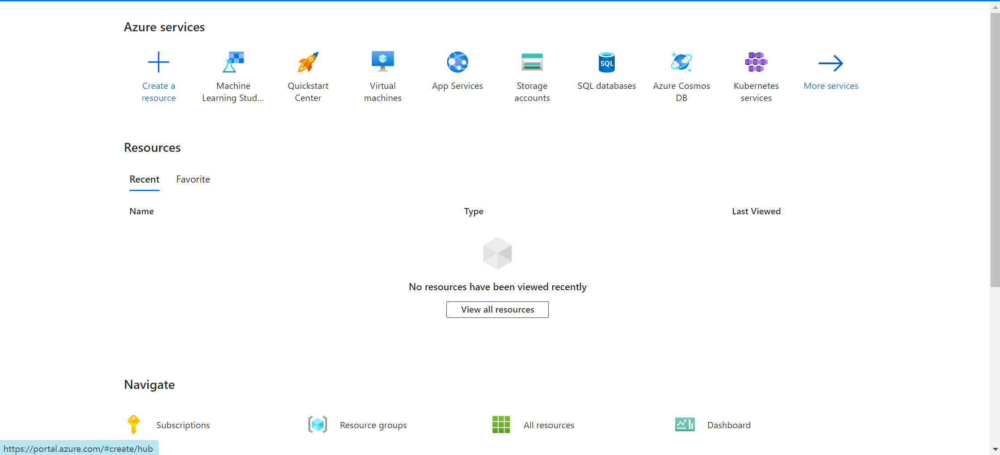
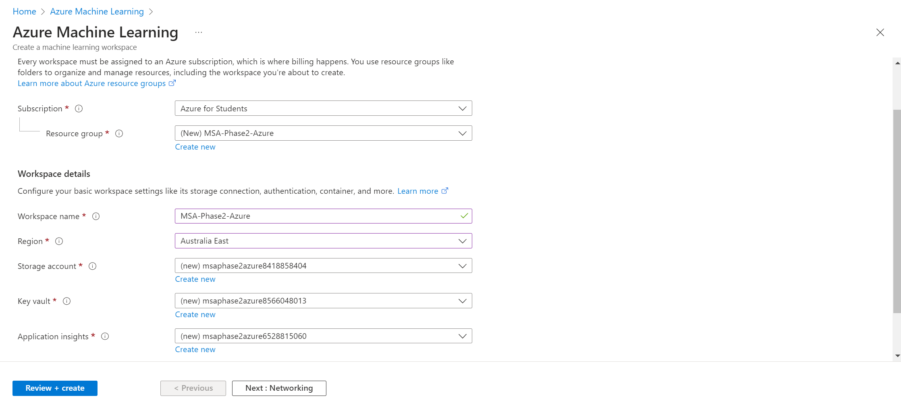
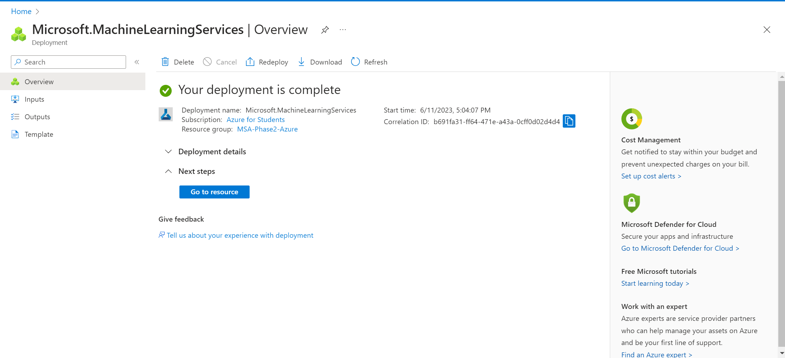
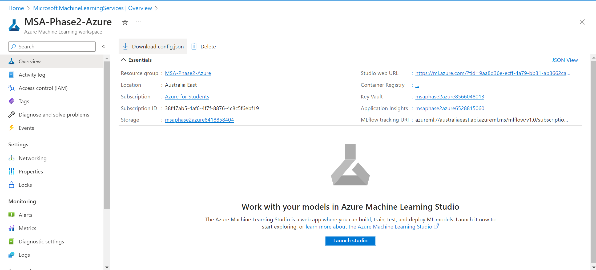
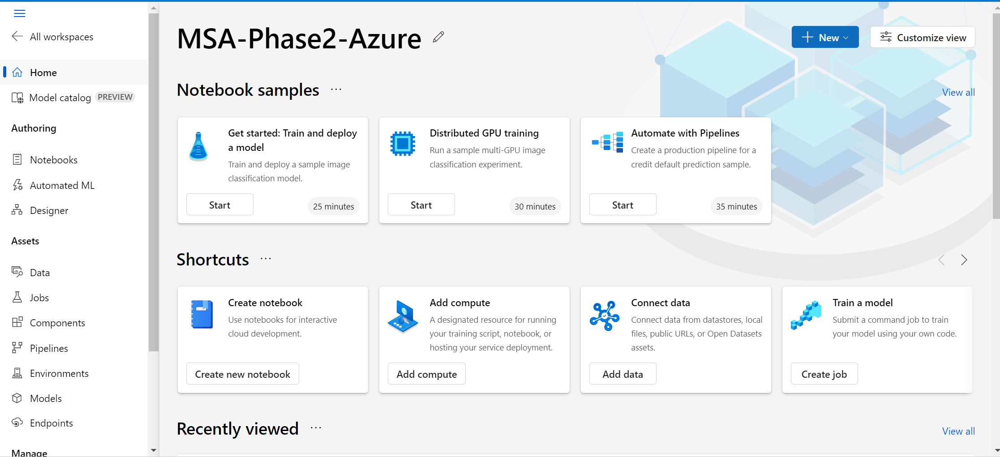

# Getting Started with Azure Machine Learning

These steps show you how to create an Azure Machine Learning workspace, a resource inside Azure that is needed to run Azure Machine Learning Studio, a web app where you can build, train, test, and deploy machine learning models without extensive coding. It also offers pre-built modules, a drag-and-drop interface, experiment tracking, collaboration features, and integration with other Azure services.

1. Ensure that you have signed up for an Azure for Students subscription using the [Microsoft Azure Sign-Up Instructions](https://github.com/NZMSA/2023-Phase-2#microsoft-azure-sign-up-instructions).

2. Log in to the [Azure portal](https://portal.azure.com) using the same email you used sign up for the above. You should see something similar to the image below after logging in.

3. Go to [Create a machine learning workspace](https://portal.azure.com/#create/Microsoft.MachineLearningServices). You should see something similar to the image below.
    - Fill in the fields with the following details:
        - Subscription: Azure for Students
        - Resource group: Create a new resource group and name it _MSA2023-Phase2-Azure_
        - Workspace name: Name your workspace _MSA2023-Phase2-Azure_
        - Region: Australia East
        - Leave all other settings as they are
    - Click "Review + Create", then "Create"

4. Once the deployment of your workspace has completed (this should take 60-90 seconds), you should see something similar to the image below.

5. Click "Go to resource". You should see something similar to the image below.
    - Click on "Download config.json" and save the config.json file into the working directory of your repository (you will need this file to connect to your workspace later).

6. Click "Launch studio" at the bottom of the Overview section. You should now be in Azure Machine Learning Studio, as shown in the image below.
    - If you encounter an error that starts with _Selected user account does not exist..._, open [this link](https://ml.azure.com) in Incognito/Private mode and log in.

For more details, please visit the following links:
- [Azure Machine Learning documentation](https://learn.microsoft.com/en-us/azure/machine-learning)
- [Azure Machine Learning workspaces](https://learn.microsoft.com/en-us/training/modules/intro-to-azure-machine-learning-service/2-azure-ml-workspace)
- [Create an Azure Machine Learning workspace](https://learn.microsoft.com/en-us/training/modules/explore-azure-machine-learning-workspace-resources-assets/2-provision)
- [Set up Visual Studio Code desktop with the Azure Machine Learning extension](https://learn.microsoft.com/en-us/azure/machine-learning/how-to-setup-vs-code)